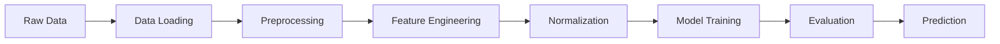

# WiFi Fingerprinting for Indoor Positioning


## 📋 Mục Lục

- [Giới thiệu](#-giới-thiệu)
- [Bài toán](#-bài-toán)
- [Dữ liệu](#-dữ-liệu)
- [Phương pháp](#-phương-pháp)
- [Cài đặt](#-cài-đặt)
- [Cấu trúc Project](#-cấu-trúc-project)
- [Hướng dẫn sử dụng](#-hướng-dẫn-sử-dụng)
- [Kết quả](#-kết-quả)
- [Trực quan hóa](#-trực-quan-hóa)
- [API Reference](#-api-reference)
- [Hạn chế và cải tiến](#-hạn-chế-và-cải-tiến)
- [Đóng góp](#-đóng-góp)
- [Tài liệu tham khảo](#-tài-liệu-tham-khảo)

## 🎯 Giới thiệu

Dự án này xây dựng một hệ thống định vị trong nhà (Indoor Positioning System - IPS) sử dụng kỹ thuật **WiFi Fingerprinting**. Hệ thống có thể dự đoán vị trí của người dùng dựa trên cường độ tín hiệu WiFi (RSSI - Received Signal Strength Indicator) từ các access point xung quanh.

### Tính năng chính:

- ✅ Dự đoán tọa độ vị trí (longitude, latitude) từ dữ liệu RSSI
- ✅ So sánh hiệu suất của 4 thuật toán machine learning khác nhau
- ✅ Trực quan hóa kết quả và phân tích lỗi chi tiết
- ✅ Hàm tiện ích để dự đoán vị trí cho dữ liệu mới
- ✅ Ước lượng độ tin cậy của dự đoán
- ✅ Giao diện notebook tương tác hoàn chỉnh

## 🎯 Bài toán

### Định nghĩa bài toán

**Input**: Vector RSSI từ N access points WiFi  
**Output**: Tọa độ vị trí (longitude, latitude)  
**Mục tiêu**: Minimize lỗi dự đoán vị trí (RMSE, MAE)

### Ứng dụng thực tế

- 🏢 **Navigation trong tòa nhà**: Hướng dẫn đường đi trong shopping mall, bệnh viện
- 🏫 **Campus tracking**: Theo dõi vị trí sinh viên, nhân viên trong trường học
- 🏭 **Asset tracking**: Quản lý tài sản, thiết bị trong nhà máy
- 🚗 **Parking guidance**: Hướng dẫn tìm chỗ đậu xe trong garage
- 🏪 **Retail analytics**: Phân tích hành vi khách hàng trong cửa hàng

## 📊 Dữ liệu

### Mô tả dataset

- **Training data**: `B0_training_data_m95.csv` (5,249 mẫu)
- **Validation data**: `B0_validation_data_m95.csv` (536 mẫu)
- **Số access points**: 12 (AP13, AP14, AP35, AP36, AP41, AP42, AP51, AP52, AP155, AP156, AP161, AP162)

### Cấu trúc dữ liệu

| Cột                 | Mô tả                        | Kiểu dữ liệu | Ví dụ         |
| ------------------- | ---------------------------- | ------------ | ------------- |
| `LONGITUDE`         | Tọa độ kinh độ (target)      | float        | -7632.1436    |
| `LATITUDE`          | Tọa độ vĩ độ (target)        | float        | 4864982.2171  |
| `AP13`, `AP14`, ... | Cường độ tín hiệu RSSI (dBm) | float        | -105.0, -79.0 |
| `FLOOR`             | Tầng                         | float        | 0.0, 1.0, 2.0 |
| `BUILDINGID`        | ID tòa nhà                   | float        | 0.0           |
| `USERID`, `PHONEID` | Thông tin user và device     | float        | 11.0, 13.0    |

### Đặc điểm dữ liệu

- **Phạm vi RSSI**: -105 dBm đến -31 dBm
- **Giá trị đặc biệt**: -105 dBm biểu thị không có tín hiệu
- **Phân bố không gian**: Dữ liệu tập trung ở một số khu vực nhất định
- **Chất lượng**: Không có missing values, dữ liệu đã được tiền xử lý

## 🔬 Phương pháp

### Pipeline xử lý dữ liệu



### Các thuật toán được so sánh

1. **Random Forest Regressor**

   - Ensemble method, robust với outliers
   - Hyperparameters: n_estimators=100, max_depth=20
   - Ưu điểm: Tự động feature selection, ít overfitting

2. **K-Nearest Neighbors (KNN)**

   - k=5 và k=10, weights='distance'
   - Phù hợp với bài toán fingerprinting
   - Ưu điểm: Đơn giản, hiệu quả với dữ liệu có pattern cục bộ

3. **Support Vector Regression (SVR)**
   - Kernel RBF, C=1.0, gamma='scale'
   - Sử dụng MultiOutputRegressor
   - Ưu điểm: Hiệu quả với dữ liệu high-dimensional

### Metrics đánh giá

- **RMSE (Root Mean Square Error)**: Lỗi bình phương trung bình
- **MAE (Mean Absolute Error)**: Lỗi tuyệt đối trung bình
- **R² Score**: Hệ số tương quan
- **Euclidean Distance Error**: Khoảng cách Euclidean giữa dự đoán và thực tế

## 🛠 Cài đặt

### Yêu cầu hệ thống

- Python 3.7+
- Jupyter Notebook hoặc JupyterLab
- RAM: Tối thiểu 4GB (khuyến nghị 8GB+)

### Cài đặt dependencies

```bash
# Clone repository
git clone <repository-url>
cd wifi-fingerprinting

# Tạo virtual environment (khuyến nghị)
python -m venv venv
source venv/bin/activate  # Linux/Mac
# hoặc
venv\Scripts\activate     # Windows

# Cài đặt packages
pip install -r requirements.txt
```

### File requirements.txt

```
pandas>=1.3.0
numpy>=1.21.0
scikit-learn>=1.0.0
matplotlib>=3.5.0
seaborn>=0.11.0
scipy>=1.7.0
jupyter>=1.0.0
```

## 📁 Cấu trúc Project

```
wifi-fingerprinting/
├── README.md                          # File này
├── requirements.txt                   # Dependencies
├── wifi_fingerprinting.ipynb         # Notebook chính
├── data/
│   ├── B0_training_data_m95.csv      # Dữ liệu training
│   └── B0_validation_data_m95.csv    # Dữ liệu validation
├── models/                           # Lưu models đã train (tùy chọn)
├── results/                          # Kết quả và visualizations
└── utils/                           # Utility functions (mở rộng)
```

## 🚀 Hướng dẫn sử dụng

### 1. Chạy notebook hoàn chỉnh

```bash
# Khởi động Jupyter
jupyter notebook wifi_fingerprinting.ipynb

# Hoặc sử dụng JupyterLab
jupyter lab wifi_fingerprinting.ipynb
```

### 2. Chạy từng bước

#### Bước 1: Load và explore dữ liệu

```python
import pandas as pd
import numpy as np

# Load data
train_data = pd.read_csv('B0_training_data_m95.csv')
validation_data = pd.read_csv('B0_validation_data_m95.csv')

print(f"Training shape: {train_data.shape}")
print(f"Validation shape: {validation_data.shape}")
```

#### Bước 2: Preprocessing

```python
# Tách features và targets
rssi_columns = ['AP13', 'AP14', 'AP35', 'AP36', 'AP41', 'AP42',
                'AP51', 'AP52', 'AP155', 'AP156', 'AP161', 'AP162']
target_columns = ['LONGITUDE', 'LATITUDE']

X_train = train_data[rssi_columns].values
y_train = train_data[target_columns].values
```

#### Bước 3: Training models

```python
from sklearn.ensemble import RandomForestRegressor
from sklearn.preprocessing import StandardScaler

# Chuẩn hóa dữ liệu
scaler_X = StandardScaler()
X_train_scaled = scaler_X.fit_transform(X_train)

scaler_y = StandardScaler()
y_train_scaled = scaler_y.fit_transform(y_train)

# Train model
model = RandomForestRegressor(n_estimators=100, random_state=42)
model.fit(X_train_scaled, y_train_scaled)
```

#### Bước 4: Prediction

```python
def predict_location(rssi_values, model, scaler_X, scaler_y):
    """Dự đoán vị trí từ RSSI values"""
    rssi_scaled = scaler_X.transform([rssi_values])
    location_scaled = model.predict(rssi_scaled)
    location = scaler_y.inverse_transform(location_scaled)
    return location[0]

# Sử dụng
new_rssi = [-80, -85, -105, -90, -75, -105, -70, -68, -105, -105, -82, -79]
predicted_location = predict_location(new_rssi, model, scaler_X, scaler_y)
print(f"Predicted location: {predicted_location}")
```

## 📈 Kết quả

### So sánh hiệu suất các mô hình

| Model         | Train RMSE | Val RMSE  | Val MAE   | Training Time | R² Score  |
| ------------- | ---------- | --------- | --------- | ------------- | --------- |
| **SVR**       | 11.44      | **15.05** | **10.42** | 4.27s         | **0.727** |
| Random Forest | 5.78       | 16.24     | 11.43     | 0.29s         | 0.695     |
| KNN (k=10)    | 4.98       | 15.95     | 10.99     | 0.04s         | 0.712     |
| KNN (k=5)     | 4.91       | 16.83     | 11.36     | 0.04s         | 0.678     |

### Phân tích kết quả

**🏆 Mô hình tốt nhất: SVR**

- Validation RMSE: 15.05
- Validation MAE: 10.42
- R² Score: 0.727 (Longitude: 0.696, Latitude: 0.758)
- 95% dự đoán có lỗi ≤ 41.49 đơn vị khoảng cách

**📊 Thống kê lỗi dự đoán:**

- Lỗi trung bình: 16.62 đơn vị
- Lỗi trung vị: 12.75 đơn vị
- Độ lệch chuẩn: 13.29
- Lỗi tối thiểu: 0.22 đơn vị
- Lỗi tối đa: 86.40 đơn vị

## 📊 Trực quan hóa

### 1. Phân bố dữ liệu và RSSI

- Histogram phân bố giá trị RSSI
- Scatter plot vị trí trong không gian 2D
- So sánh phân bố train vs validation
- Bar chart trung bình RSSI theo access point

### 2. Đánh giá mô hình

- So sánh RMSE và MAE giữa các models
- Thời gian training
- RMSE theo longitude vs latitude
- Confusion matrix cho classification problems

### 3. Phân tích dự đoán

- Scatter plot: Predicted vs Actual (cả longitude và latitude)
- Histogram phân bố lỗi Euclidean
- Map 2D hiển thị actual vs predicted locations
- Error analysis theo vùng không gian

### 4. Demo dự đoán thực tế

- Visualization kết quả trên 5 mẫu test
- Đường kết nối giữa actual và predicted
- Thông tin chi tiết về RSSI signals mạnh nhất

## 🔧 API Reference

### Hàm chính

#### `predict_location(rssi_values, model, scaler_X, scaler_y, rssi_columns)`

Dự đoán vị trí từ dữ liệu RSSI mới.

**Parameters:**

- `rssi_values` (list): Danh sách giá trị RSSI từ 12 access points
- `model`: Mô hình đã được train
- `scaler_X`: StandardScaler cho features
- `scaler_y`: StandardScaler cho targets
- `rssi_columns` (list): Danh sách tên các cột RSSI

**Returns:**

- `tuple`: (longitude, latitude)

**Example:**

```python
rssi = [-80, -85, -105, -90, -75, -105, -70, -68, -105, -105, -82, -79]
location = predict_location(rssi, best_model, scaler_X, scaler_y, rssi_columns)
# Output: (-7625.3456, 4864978.1234)
```

#### `calculate_prediction_confidence(rssi_values, model, scaler_X, scaler_y, rssi_columns, train_data)`

Tính toán độ tin cậy của dự đoán.

**Parameters:**

- Tương tự `predict_location()` + `train_data`

**Returns:**

- `tuple`: (predicted_location, confidence, avg_distance)

**Example:**

```python
location, confidence, distance = calculate_prediction_confidence(
    rssi, best_model, scaler_X, scaler_y, rssi_columns, train_data
)
print(f"Location: {location}, Confidence: {confidence:.3f}")
# Output: Location: (-7625.35, 4864978.12), Confidence: 0.756
```

### Biến quan trọng

- `best_model`: Mô hình SVR tốt nhất đã train
- `scaler_X`, `scaler_y`: StandardScalers đã fit
- `rssi_columns`: ['AP13', 'AP14', ..., 'AP162']
- `target_columns`: ['LONGITUDE', 'LATITUDE']
- `results`: Dictionary chứa metrics của tất cả models
- `trained_models`: Dictionary chứa tất cả models đã train

## ⚠️ Hạn chế và cải tiến

### Hạn chế hiện tại

1. **Phạm vi ứng dụng**

   - Chỉ hoạt động trong môi trường đã train
   - Cần retrain khi infrastructure WiFi thay đổi
   - Hiệu suất giảm ở vùng không có dữ liệu train

2. **Yếu tố môi trường**

   - RSSI bị ảnh hưởng bởi thời tiết, mật độ người
   - Sự thay đổi vật lý của building
   - Interference từ các thiết bị khác

3. **Độ chính xác**
   - Lỗi trung bình ~16 mét (có thể cao cho một số ứng dụng)
   - Accuracy không đồng đều trong không gian
   - Biên độ lỗi lớn (0.2 - 86 mét)

### Hướng cải tiến

1. **Cải thiện mô hình**

   ```python
   # Deep Learning approaches
   import tensorflow as tf

   # Neural Network for WiFi fingerprinting
   model = tf.keras.Sequential([
       tf.keras.layers.Dense(128, activation='relu'),
       tf.keras.layers.Dropout(0.3),
       tf.keras.layers.Dense(64, activation='relu'),
       tf.keras.layers.Dense(2)  # longitude, latitude
   ])
   ```

2. **Feature Engineering nâng cao**

   ```python
   # Time-based features
   train_data['hour'] = pd.to_datetime(train_data['TIMESTAMP'], unit='s').dt.hour
   train_data['day_of_week'] = pd.to_datetime(train_data['TIMESTAMP'], unit='s').dt.dayofweek

   # Signal strength ratios
   train_data['AP_ratio_1'] = train_data['AP13'] / train_data['AP14']
   train_data['max_signal'] = train_data[rssi_columns].max(axis=1)
   ```

3. **Ensemble Methods**

   ```python
   from sklearn.ensemble import VotingRegressor

   ensemble = VotingRegressor([
       ('rf', RandomForestRegressor()),
       ('svr', MultiOutputRegressor(SVR())),
       ('knn', KNeighborsRegressor())
   ])
   ```

4. **Real-time adaptation**

   ```python
   # Online learning approach
   from sklearn.linear_model import SGDRegressor

   online_model = SGDRegressor()
   # Continuous learning from new data
   ```

## 🤝 Đóng góp

Chúng tôi hoan nghênh các đóng góp! Hãy follow workflow sau:

1. **Fork** repository
2. **Create** feature branch (`git checkout -b feature/AmazingFeature`)
3. **Commit** changes (`git commit -m 'Add some AmazingFeature'`)
4. **Push** to branch (`git push origin feature/AmazingFeature`)
5. **Open** Pull Request

### Coding Standards

```python
# Follow PEP 8
# Use type hints
def predict_location(rssi_values: List[float],
                    model: Any,
                    scaler_X: StandardScaler,
                    scaler_y: StandardScaler) -> Tuple[float, float]:
    """
    Predict location from RSSI values.

    Args:
        rssi_values: List of RSSI values from access points
        model: Trained machine learning model
        scaler_X: Feature scaler
        scaler_y: Target scaler

    Returns:
        Tuple of (longitude, latitude)
    """
    pass
```

### Đóng góp có thể bao gồm

- 🐛 **Bug fixes**
- ✨ **New features** (new algorithms, visualizations)
- 📚 **Documentation** improvements
- 🧪 **Tests** và test coverage
- 🎨 **Performance** optimizations
- 🌐 **Internationalization** (thêm ngôn ngữ khác)

## 📚 Tài liệu tham khảo

### Papers và Research

1. **"WiFi Fingerprinting Indoor Localization"** - IEEE Survey
2. **"Machine Learning for Indoor Positioning"** - ACM Computing Surveys
3. **"RSSI-based Indoor Localization"** - Sensors Journal
4. **"Deep Learning for WiFi Fingerprinting"** - Neural Networks

### Libraries và Tools

- [scikit-learn](https://scikit-learn.org/) - Machine Learning library
- [pandas](https://pandas.pydata.org/) - Data manipulation
- [matplotlib](https://matplotlib.org/) - Plotting
- [seaborn](https://seaborn.pydata.org/) - Statistical visualization
- [numpy](https://numpy.org/) - Numerical computing

### Datasets và Benchmarks

- [UJIIndoorLoc](https://archive.ics.uci.edu/ml/datasets/UJIIndoorLoc) - UCI ML Repository
- [WiFi Indoor Localization](https://www.kaggle.com/datasets) - Kaggle datasets
- [Microsoft Indoor Localization](https://www.microsoft.com/en-us/research/) - Research datasets

### Online Resources

- [Indoor Positioning and Navigation](https://www.ipin-conference.org/) - IPIN Conference
- [Location-Based Services](https://link.springer.com/) - Springer journals
- [WiFi Alliance](https://www.wi-fi.org/) - WiFi standards và specifications

---

## 📄 License

Dự án này được phân phối dưới MIT License. Xem file `LICENSE` để biết thêm chi tiết.

## 👥 Authors

- **Tác giả**: [Tên của bạn]
- **Email**: [email@example.com]
- **GitHub**: [github.com/username]

## 🙏 Acknowledgments

- Cảm ơn UCI ML Repository cung cấp dataset
- Cảm ơn cộng đồng scikit-learn về các algorithms
- Cảm ơn các researchers trong lĩnh vực Indoor Positioning
- Inspiration từ các nghiên cứu về WiFi fingerprinting

---

_README này được cập nhật lần cuối: July 2025_

**⭐ Nếu dự án hữu ích, hãy cho một star trên GitHub!**
